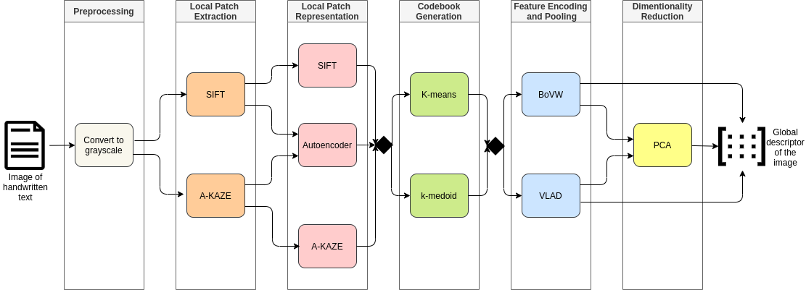

# Training the writer identification models
Three jupyter notebooks, one for each path :



with the classes/modules that support them, and many flavors of the same accuracy function and methodes to load the dataset.

## Getting Started
The notebooks can be run by jupyter notebook with python3 kernel :
- locally (with the same requirements of the web api).
- Better (and that's the recommanded method) using google colab service (Jupyter notebooks that run in the cloud and are highly integrated with Google Drive).

## Datasets Used
The project support IAM, TrigraphSlant and ICDAR2013 datasets (use whatever you want details in the Dataset_loader module):
```
.
├── dataset
│   ├── IAM
│   └── ICDAR2013
│   └── TrigraphSlant
├── ...
├
```

## Configuration of test cases
All parameters of the different models and paths to generated files are in the config_train file, for each new test add an entry to the corresponding entry, examples are already there (but with non usfull values).

## Details of the algorithms, references ...
Coming soon ...