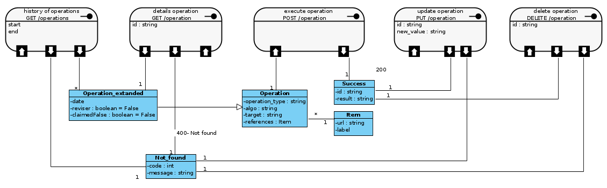

# Web Api for the models develloped and face_recognition
Rest api that can :
- Detect the writer of a document based on the handwriting using other labelled references.
- Detect faces in an image and video based on labelled references.
- Store details of operations in a noSQL DB (mongoDB).
- Provide some basic operations on the stored "operations" (get, update, delete) and give some indicators about the general state of the api.
- There is a private mode (by default) and a public one (where an url is generated to thst the api on the internet with a distante web app)

## Representation



## Accepted methodes
- For writer identification :
  - SDVP : Sift descriptors + VLAD + PCA*
  - SEVP : Sift keypoints + Encoder + VLAD + PCA*
  - SDB : Sift descriptors + BOW

	* *: PCA is not added yet considering it's impact on the accuracy
	* Details are in Model_training folder
- For face recognition, the library : https://github.com/ageitgey/face_recognition is used (thanks for them)

## What to install
I used python 3.8 with the packages on the requirements file.

## Examples
  ### Who is in the picture ?
  #### Request
  `POST /api/v0/operation/`

    curl --location --request POST 'http://localhost:8080/api/v0/operation' \
    --header 'Content-Type: application/json' \
    --data-raw '{
        "operation_type":"faceInPicture",
        "algo":"face_recognition",
        "references":[
            {"url":"https://i.imgur.com/uaAe4lp.jpg","label":"Obama"},
            {"url":"https://i.imgur.com/bpqwx0B.jpg","label":"Trump"},
            {"url":"https://gmsrp.cachefly.net/images/19/04/05/0bf8d3663b1525197779635c87ee8e16/960.jpg","label":"messi"}
            ],
        "target" : "https://i.imgur.com/9PPtX.jpg"
    }'

  #### Response
  `{"id":"5f64fc6e3031b39ab15a1be4","results":["Obama"]}`

  ### Who is the writer ?
  #### Request
  `POST /api/v0/operation/`

    curl --location --request POST 'http://localhost:8080/api/v0/operation' \
    --header 'Content-Type: application/json' \
    --data-raw '{
        "operation_type":"writer",
        "algo":"SDB",
        "references":[
            {"url":"https://i.imgur.com/5t5VggW.jpeg","label":"Hamid"},
            {"url":"https://i.imgur.com/v2ByskF.jpeg","label":"Hamid"},
            {"url":"https://i.imgur.com/sixqaVc.jpeg","label":"Jilali"},
            {"url":"https://i.imgur.com/tlpgYt3.jpeg","label":"Jilali"},
            {"url":"https://i.imgur.com/aZLnxau.jpeg","label":"Hmadi"}
            ],
        "target" : "https://i.imgur.com/vIYpSuG.jpeg"
    }'

  #### Response
  `{"id":"5f64ffcb3031b39ab15a1be5","results":["Hmadi"]}`

  ### What happened in the operation '5f64fc6e3031b39ab15a1be4' ?
  #### Request
  `GET /api/v0/operation/`

    curl --location --request GET 'http://localhost:8080/api/v0/operation?id=5f64fc6e3031b39ab15a1be4'

  #### Response
  ```json
  {
    "operation_type": "faceInPicture",
    "algo": "face_recognition",
    "references": [
        {
            "url": "https://i.imgur.com/uaAe4lp.jpg",
            "label": "Obama"
        },
        {
            "url": "https://i.imgur.com/bpqwx0B.jpg",
            "label": "Trump"
        },
        {
            "url": "https://gmsrp.cachefly.net/images/19/04/05/0bf8d3663b1525197779635c87ee8e16/960.jpg",
            "label": "messi"
        }
    ],
    "target": "https://i.imgur.com/9PPtX.jpg",
    "revised": false,
    "claimedFalse": false,
    "date": "2020-09-18 18:29:02",
    "results": [
        "Obama"
    ],
    "id": "5f64fc6e3031b39ab15a1be4"
  }
  ```
  ### Claim that the results of an operation were false:
  #### Request
  `PUT /api/v0/operation/`

    curl --location --request PUT 'http://localhost:8080/api/v0/operation?id=5f64fc6e3031b39ab15a1be4&new_value=true'

  #### Response
  ```json
    {
      "claimedFalse":"true",
      "id":"5f64fc6e3031b39ab15a1be4"
    }
  ```
  ### Delete rocord of an operation:
  #### Request
  `DELETE /api/v0/operation/`

    curl --location --request DELETE 'http://localhost:8080/api/v0/operation?id=5f64fc6e3031b39ab15a1be4'

  #### Response
  ```json
    {
      "id":"5f64fc6e3031b39ab15a1be4",
      "message":"operation deleted"
    }
  ```
  ### History of past operations:
  #### Request
  `GET /api/v0/operations/`

    curl --location --request GET 'http://localhost:8080/api/v0/operations?start=2020-09-01&end=2020-09-19'

  #### Response
  ```json
    [
      {"date":"2020-09-11","totalClaimed":0,"totalSum":11},
      {"date":"2020-09-12","totalClaimed":0,"totalSum":2},
      {"date":"2020-09-13","totalClaimed":0,"totalSum":1},
      {"date":"2020-09-10","totalClaimed":1,"totalSum":13},
      {"date":"2020-09-18","totalClaimed":1,"totalSum":7}
    ]
  ```
  
## Details of the algorithms, references ...
Coming soon ...